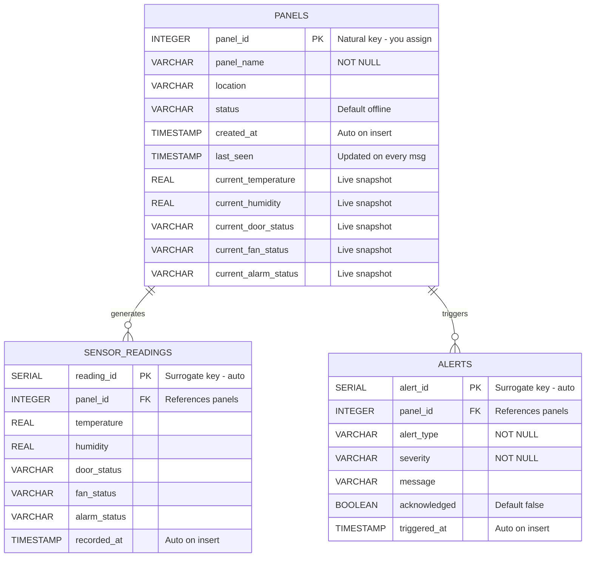

# FYP Project — Session Handoff Document
**Project:** Multi-Panel Electronics Enclosure Monitoring System with Web-Based Dashboard
**Student:** Edwin (UP2517673)
**Supervisor:** Dr. Loo Poh Kok
**Submission Deadline:** June 23, 2026
**Last Updated:** End of Step 3 (PostgreSQL Setup) + FastAPI/REST concept groundwork

---

## Project Overview

Monitors 10 electronics enclosure panels (1 physical ESP32 + 9 simulated) using:
- Temperature / humidity sensors
- RFID access control *(deferred to future work)*
- Automated cooling (fan)
- Web dashboard with real-time monitoring and predictive maintenance

---

## Locked-In Technology Stack

### Components (Main Structure)

| # | Component | Layer | Role | Status |
|---|-----------|-------|------|--------|
| 1 | Arduino + PubSubClient | ESP32 Firmware | Reads sensors, publishes MQTT, receives commands | ✅ Done |
| 2 | Mosquitto Broker (Level 2) | Communication | Routes all MQTT messages, password-authenticated | ✅ Done |
| 3 | FastAPI | Backend framework | Defines endpoints, routes requests, orchestrates data | ⬜ Step 4 |
| 4 | PostgreSQL 18 | Database | Stores all sensor readings and historical data | ✅ **Done** |
| 5 | React + Chart.js | Frontend | Web dashboard, real-time and historical display | ⬜ Step 5 |

### Connectors, Runners & Libraries (Supporting Tools)

| Package | Category | Role |
|---------|----------|------|
| `uvicorn` | Runner / ASGI server | Runs FastAPI, opens port 8000, accepts incoming HTTP |
| `paho-mqtt` | Library / connector | Lets Python code speak MQTT to Mosquitto |
| `psycopg2-binary` | Library / connector | Lets Python code speak SQL to PostgreSQL |

**The project has exactly one framework (FastAPI).** uvicorn is an engine that runs it; paho-mqtt and psycopg2 are libraries that FastAPI calls as tools.

**Optional extras (only if time permits):** Grafana, TimescaleDB, Prometheus, Docker

---

## Architecture Diagram

```
ESP32 (Arduino + PubSubClient)
        ↕ MQTT
Mosquitto Broker (Level 2)
        ↕ MQTT [paho-mqtt]
FastAPI Backend  ← run by uvicorn (port 8000)
        ↕ SQL [psycopg2]
PostgreSQL (fyp_monitoring)
        ↕ HTTP / REST
React + Chart.js
```

---

## Database Schema — Entity Relationship Diagram (ERD)



### Relationship Summary

- **PANELS → SENSOR_READINGS**: One panel generates many sensor readings (1-to-many)
- **PANELS → ALERTS**: One panel can trigger many alerts (1-to-many)
- Foreign key constraints enforce that no reading or alert can exist for a non-existent panel

---

## Key Concept: State vs Event Log — Designed at the Row Level

### The rule

> **The unit of "state vs event" is the ROW, not the column.**
>
> A row is either:
> - **Mutable state** — represents "the current truth about a thing" → all columns can be UPDATEd
> - **Immutable event** — represents "a moment frozen in time" → no columns are UPDATEd (with rare exceptions like `acknowledged` flags)
>
> You never mix the two within a single table. If you need both, split into two tables.

### How this applies to your schema

| Table | Row purpose | Write pattern | Why |
|---|---|---|---|
| `panels` | Current state of each panel | UPDATE in place | Dashboard needs fast "is it alive now?" lookups |
| `sensor_readings` | A timestamped snapshot of one moment | INSERT only | Trend charts and predictive maintenance need history |
| `alerts` | An event that happened | INSERT only (+ UPDATE on `acknowledged`) | Audit trail of anomalies; humans can mark them read |

### The `acknowledged` flag — a special case

`alerts.acknowledged` is the one exception that gets UPDATEd after creation. This is acceptable because:
1. The historical fact "the alert was raised at time X" is preserved in `triggered_at` and never changed
2. The flag represents *human action on the event*, not the event itself
3. Without this column, you'd need a separate `alert_acknowledgments` table — overkill for an FYP

### Why you can't mix within `sensor_readings`

Question: *"Can fan_status be 'current' while temperature is 'history' in the same row?"*

No — every column in a row is physically bound to that row's timestamp. If you UPDATEd `fan_status` on an old row, you'd be lying about the past. The fan was 'off' at that moment; rewriting it to 'on' destroys the truth.

The only way to have "live fan status" is to put it in a row whose **purpose** is "current snapshot" — which is why `current_fan_status` lives on the `panels` table, not on `sensor_readings`.

---

## Key Concept: Normalization vs Denormalization

### Normalization — the default

**Normalization** means storing each piece of information **exactly once**, in the table where it logically belongs, and using foreign keys to reference it from elsewhere.

Your schema is normalized in this way:
- Panel names and locations live **only** in `panels` — not repeated in millions of `sensor_readings` rows
- Sensor readings reference the panel via `panel_id` (a small integer), not by storing the full panel name on every row

**Why it matters:**
- **Storage efficiency** — 5 million sensor readings × "Server Room Panel A" = wasted disk space. 5 million × `3` (the panel_id) = tiny.
- **Update integrity** — if you rename Panel 3 from "Server A" to "Main Server", you change it in **one row** (the panels table). All readings automatically reflect the new name via the foreign key.
- **Truth lives in one place** — no risk of contradicting copies.

### Denormalization — the deliberate exception

**Denormalization** means deliberately storing a copy of derived data in a place where it doesn't strictly belong, **for the sake of read speed**.

Your `current_*` columns on the `panels` table are denormalized:
- `current_temperature` is technically *derivable* from "the most recent row in sensor_readings for this panel"
- But computing that derivation on every dashboard refresh would scan millions of rows
- So you keep a **mirrored copy** on the `panels` table that gets UPDATEd on every message
- The dashboard query becomes `SELECT * FROM panels` — 10 rows, instant

**The trade-off:**

| | Normalized only | With denormalized current_* columns |
|---|---|---|
| Storage | Minimal | Slightly more (10 extra cells per panel) |
| Write complexity | 1 INSERT per message | 1 INSERT + 1 UPDATE per message |
| Read complexity (dashboard live view) | Complex query, slow at scale | `SELECT * FROM panels` — instant |
| Risk | None | If your code forgets to UPDATE, the snapshot goes stale |

### The general principle

> **Start normalized. Denormalize only when you have a measured performance reason and you're willing to accept the extra write complexity.**

### Career talking point

> "I designed a normalized relational schema with foreign key integrity, then strategically denormalized current-state columns onto the parent table to optimize the dashboard's most frequent read pattern. This trades a minor write overhead for a major reduction in read latency and query complexity."

---

## Key Concept: FastAPI, uvicorn, REST — Vocabulary Lock-In

This section captures the full vocabulary groundwork laid before Step 4. Every term here will appear in the `main.py` written next session.

### Component vs Connector vs Runner vs Framework vs Library

| Term | Definition | Example |
|---|---|---|
| **Component** | A major box in your architecture diagram | FastAPI, Mosquitto, PostgreSQL, React |
| **Connector** | A library that lets one component speak to another | paho-mqtt, psycopg2 |
| **Runner / engine** | A program that executes your code and keeps it alive | uvicorn |
| **Framework** | Code that is in charge — it calls *your* code when events happen | FastAPI |
| **Library** | Code you call — you're in charge, the library is a tool | paho-mqtt, psycopg2, json |
| **Protocol** | A language two things use to communicate | HTTP, MQTT, SQL |

### Framework vs Library — the key distinction

- With a **library**, *you call it*. You drive the program, and you reach for the library when you need a tool.
- With a **framework**, *it calls you*. You write pieces of code (endpoint functions), hand them to the framework, and the framework decides when to run them.

This is called **inversion of control**: *"don't call us, we'll call you."*

**In your project:**

| Package | Type | Who's in charge? |
|---|---|---|
| FastAPI | Framework | FastAPI is in charge — it calls your endpoint functions |
| uvicorn | Runner / ASGI server | uvicorn runs FastAPI and handles network I/O |
| paho-mqtt | Library | *You* call paho-mqtt when you want to publish/subscribe |
| psycopg2 | Library | *You* call psycopg2 when you want to run a SQL query |

**One framework total in this project — FastAPI.** Everything else is either a runner (uvicorn) or a plain library (paho-mqtt, psycopg2).

### uvicorn — the engine

**uvicorn is not a framework and not a connector. It is an ASGI server that runs FastAPI.**

Two jobs:
1. Keep the FastAPI process alive in memory
2. Open port 8000 and listen for incoming HTTP requests

Analogy: **FastAPI is the car you designed. uvicorn is the engine that makes it move.** Without the engine, the car is just a shape. Without the car, the engine has nothing to power.

You could replace uvicorn with another ASGI server (hypercorn, daphne, granian) — they all follow the same ASGI standard. Most people use uvicorn because it's the default in FastAPI's docs.

### REST — a design style, not code

**REST is not a library you install. It is a set of conventions for how to design URLs and HTTP verbs.**

Following REST means:
- URLs describe **resources** (nouns): `/panels`, `/alerts`
- HTTP verbs describe **actions**: `GET` to read, `POST` to create/command, `PUT` to update, `DELETE` to remove
- Responses are usually JSON
- Each request is independent (stateless)

FastAPI gives you the *tools* to build REST APIs easily (`@app.get`, `@app.post` decorators) but doesn't force you to use them RESTfully. REST lives in your code's design choices, not in any library.

**Analogy:** REST is like "Italian cuisine" — a style of cooking, not an ingredient. FastAPI is the kitchen. uvicorn is the stove. Your code follows the Italian style by using olive oil and pasta (nouns and HTTP verbs), but nothing stops you from cooking Thai in the same kitchen if you wanted to.

### REST API vs URL vs Endpoint vs HTTP verb

| Term | What it is |
|---|---|
| **REST API** | The complete published menu of operations the backend allows |
| **Endpoint** | One specific URL + HTTP verb combination that does one specific thing |
| **URL** | The address part of an endpoint (e.g., `/panels/3`) |
| **HTTP verb** | The action part of an endpoint (`GET`, `POST`, `PUT`, `DELETE`) |
| **HTTP** | Both the vocabulary of verbs AND the protocol that carries requests/responses over the network |
| **JSON** | The text format used for request and response bodies |

**Example: your future FYP REST API**

| Endpoint | Purpose | Returns |
|---|---|---|
| `GET /panels` | List all 10 panels with current state | JSON array |
| `GET /panels/3` | Get details for Panel 3 | JSON object |
| `GET /panels/3/history?hours=24` | Panel 3's readings for last 24h | JSON array |
| `GET /alerts?unacknowledged=true` | All unread alerts | JSON array |
| `POST /panels/3/control/fan` | Command Panel 3's fan | Status message |

Five endpoints = one REST API.

### Incoming vs Outgoing connections

**This is the single most important structural insight from this session.**

FastAPI sits in the middle of your architecture. Connections go two different directions:

**Incoming (React → FastAPI):**
- React *calls into* FastAPI over HTTP
- uvicorn holds port 8000 open and accepts these calls
- uvicorn parses the HTTP bytes and hands the request to FastAPI via the ASGI contract

**Outgoing (FastAPI → PostgreSQL / Mosquitto):**
- FastAPI *reaches out* to other services
- psycopg2 dials out to PostgreSQL on port 5432
- paho-mqtt dials out to Mosquitto on port 1883
- These outbound connections have nothing to do with uvicorn

```
                    ┌──────────────────────────────────┐
                    │  uvicorn — holds port 8000 open  │
                    │  ┌────────────────────────────┐  │
React  ──HTTP──────►│  │  FastAPI (the brain)       │  │
                    │  │                            │  │
                    │  │  [paho-mqtt]  ── MQTT ─────┼──┼──► Mosquitto
                    │  │  [psycopg2]   ── SQL  ─────┼──┼──► PostgreSQL
                    │  └────────────────────────────┘  │
                    └──────────────────────────────────┘
```

**One-liner:** *uvicorn answers the door; psycopg2 and paho-mqtt dial out.*

### Failure-mode reasoning (loose coupling)

| If this breaks | React → FastAPI | FastAPI → PostgreSQL | FastAPI → Mosquitto |
|---|---|---|---|
| uvicorn crashes | ❌ Dead (no port) | ❌ Dead (no process) | ❌ Dead (no process) |
| psycopg2 crashes | ✅ Works | ❌ DB reads/writes fail | ✅ Works |
| paho-mqtt crashes | ✅ Works | ✅ Works | ❌ No MQTT messages |
| PostgreSQL goes down | ✅ Works | ❌ Errors returned | ✅ Works |
| Mosquitto goes down | ✅ Works | ✅ Works | ❌ No new data flows in |

The REST API and the MQTT subscriber are **loosely coupled** — they share a process but not a failure mode. If MQTT ingestion stops, the dashboard still serves the last-known state from PostgreSQL. This is a deliberate architectural property worth mentioning in the FYP report.

### The complete request flow (memorize this)

When React asks for `GET /panels`:

```
1.  React sends HTTP request "GET /panels" to 192.168.100.2:8000
2.  uvicorn (listening on port 8000) accepts the bytes
3.  uvicorn parses the HTTP and hands a Python object to FastAPI via ASGI
4.  FastAPI looks at the URL and verb, picks the right endpoint function
5.  Your endpoint function runs; it calls psycopg2 to query PostgreSQL
6.  psycopg2 runs "SELECT * FROM panels" and returns rows
7.  Your function returns a Python dict
8.  FastAPI converts the dict to JSON
9.  FastAPI hands the JSON response back to uvicorn
10. uvicorn sends the JSON over HTTP back to React
11. React receives the JSON and renders the dashboard
```

Every term in that chain is now defined. When writing `main.py` next session, each line of code will correspond to one or more steps above.

---

## Completed Milestones

### 1. Mosquitto Broker ✅
- Installed on Windows 11
- Level 2 config: password auth, dual logging, persistence, 50-client limit
- Manual launch:
  ```
  mosquitto -c "C:\Program Files\mosquitto\mosquitto.conf" -v
  ```
- Users: `esp32_panel` / `test`, `backend_server` / `backend123` *(or whatever was reset to)*
- Firewall rule for port 1883 added

### 2. ESP32 Firmware ✅
- Library: PubSubClient v2.8.0
- Code: `esp32_v4_0_MOSQUITTO.ino` + `credentials.h`
- Topics published: `panel/1/{temperature, humidity, door_status, fan_status, alarm_status}`
- Topics subscribed: `panel/1/control/{fan, reset}`
- Two-way control confirmed working

### 3. FastAPI Dev Environment ✅
- Python 3.13.2, pip 24.3.1
- Virtual environment: `C:\Users\Admin\Downloads\Project_MQTT\FYP\FYP_Backend\venv`
- Installed: `fastapi uvicorn paho-mqtt psycopg2-binary`
- **Note:** these are installed but not yet imported anywhere. First use is Step 4.

### 4. Basic MQTT Subscriber ✅
- File: `mqtt_subscriber.py`
- Subscribes as `backend_server` to `panel/#`
- Uses paho-mqtt only — **no FastAPI code yet**
- Full data flow confirmed: ESP32 → Mosquitto → Python (prints to terminal)

### 5. PostgreSQL Setup ✅ **(NEW)**
- PostgreSQL 18 installed on Windows 11
- PATH configured: `C:\Program Files\PostgreSQL\18\bin`
- Database created: `fyp_monitoring`
- Three tables created with foreign key relationships
- 10 panel rows inserted as initial reference data

---

## PostgreSQL Quick Reference

### Connect
```
psql -U postgres
```
(Type password blindly — no characters appear as you type. Press Enter.)

### Switch to FYP database
```
\c fyp_monitoring
```

### Useful psql shortcuts (backslash, not forward slash!)
| Command | What it does |
|---|---|
| `\l` | List all databases |
| `\c <database>` | Connect to a database |
| `\dt` | List tables in current database |
| `\d <table>` | Show table structure (columns, indexes, FKs) |
| `\du` | List users/roles |
| `\q` | Quit psql |

### View current data
```sql
SELECT * FROM panels;
SELECT * FROM sensor_readings ORDER BY recorded_at DESC LIMIT 10;
SELECT * FROM alerts WHERE acknowledged = FALSE;
```

### Reset (if you need to start over)
```sql
DROP TABLE alerts;
DROP TABLE sensor_readings;
DROP TABLE panels;
-- Then re-run the CREATE TABLE statements below
```

---

## Complete Schema SQL (for re-creation if needed)

```sql
-- Table 1: panels (current state)
CREATE TABLE panels (
    panel_id INTEGER PRIMARY KEY,
    panel_name VARCHAR(100) NOT NULL,
    location VARCHAR(200),
    status VARCHAR(20) DEFAULT 'offline',
    created_at TIMESTAMP DEFAULT CURRENT_TIMESTAMP,
    last_seen TIMESTAMP,
    current_temperature REAL,
    current_humidity REAL,
    current_door_status VARCHAR(20),
    current_fan_status VARCHAR(20),
    current_alarm_status VARCHAR(20)
);

-- Table 2: sensor_readings (event log)
CREATE TABLE sensor_readings (
    reading_id SERIAL PRIMARY KEY,
    panel_id INTEGER REFERENCES panels(panel_id),
    temperature REAL,
    humidity REAL,
    door_status VARCHAR(20),
    fan_status VARCHAR(20),
    alarm_status VARCHAR(20),
    recorded_at TIMESTAMP DEFAULT CURRENT_TIMESTAMP
);

-- Table 3: alerts (event log)
CREATE TABLE alerts (
    alert_id SERIAL PRIMARY KEY,
    panel_id INTEGER REFERENCES panels(panel_id),
    alert_type VARCHAR(50) NOT NULL,
    severity VARCHAR(20) NOT NULL,
    message VARCHAR(500),
    acknowledged BOOLEAN DEFAULT FALSE,
    triggered_at TIMESTAMP DEFAULT CURRENT_TIMESTAMP
);

-- Initial panel data
INSERT INTO panels (panel_id, panel_name, location, status) VALUES
(1, 'Panel 1', 'Physical ESP32', 'offline'),
(2, 'Panel 2', 'Simulated', 'offline'),
(3, 'Panel 3', 'Simulated', 'offline'),
(4, 'Panel 4', 'Simulated', 'offline'),
(5, 'Panel 5', 'Simulated', 'offline'),
(6, 'Panel 6', 'Simulated', 'offline'),
(7, 'Panel 7', 'Simulated', 'offline'),
(8, 'Panel 8', 'Simulated', 'offline'),
(9, 'Panel 9', 'Simulated', 'offline'),
(10, 'Panel 10', 'Simulated', 'offline');
```

---

## Network Topology

### Current Development Setup
```
ESP32 (10.153.203.189)
    ↕ WiFi hotspot (subnet: 10.153.203.x)
Mobile Phone (NAT bridge)
    inner: 10.153.203.1
    outer: 192.168.100.223
    ↕ WiFi (subnet: 192.168.100.x)
Home Router (192.168.100.1)
    ↕ Ethernet
PC / Mosquitto / PostgreSQL (192.168.100.2)
```

### Critical Rule
> Phone must be on **WiFi (not mobile data)** for ESP32 to reach PC. Hard reboot ESP32 after switching.

---

## Key Configuration Reference

| Item | Value |
|------|-------|
| Mosquitto Broker IP | `192.168.100.2` |
| Mosquitto Port | `1883` |
| ESP32 MQTT User | `esp32_panel` |
| Backend MQTT User | `backend_server` |
| PostgreSQL Host | `localhost` |
| PostgreSQL Port | `5432` |
| PostgreSQL Database | `fyp_monitoring` |
| PostgreSQL User | `postgres` |
| FastAPI Port (future) | `8000` |
| FYP_Backend path | `C:\Users\Admin\Downloads\Project_MQTT\FYP\FYP_Backend` |

---

## How to Start Everything (Checklist)

**Pre-flight check:** Confirm phone is on **WiFi** (not mobile data) — otherwise ESP32 cannot reach the PC. After switching, hard reboot the ESP32.

Open 3 Command Prompt windows:

**Window 1 — Mosquitto broker:**
```
mosquitto -c "C:\Program Files\mosquitto\mosquitto.conf" -v
```

**Window 2 — Activate venv and run subscriber:**
```
cd C:\Users\Admin\Downloads\Project_MQTT\FYP\FYP_Backend
venv\Scripts\activate
python mqtt_subscriber.py
```

**Window 3 — PostgreSQL (when needed):**
```
psql -U postgres
\c fyp_monitoring
```

Then power on ESP32.

---

## Progression Tracker

```
Step 1 — venv + pip install                ✅ Done
Step 2 — mqtt_subscriber.py (paho only)    ✅ Done  ← standalone Python, no FastAPI
Step 3 — PostgreSQL setup                  ✅ Done  ← schema ready, empty of sensor data
Step 4 — FastAPI app (REST + DB writes)    ⬜ Next  ← first FastAPI code ever
Step 5 — React frontend                    ⬜ Later
```

**Two steps remaining.** Step 4 is one app with three responsibilities (MQTT subscriber + database writes + REST endpoints). Step 5 is the React dashboard.

---

## Next Step — Step 4: Build the FastAPI App

This is where uvicorn, FastAPI, paho-mqtt, and psycopg2 finally meet in a single file.

### What to build (one file: `main.py`)

The app will have three responsibilities bundled together:

1. **MQTT subscriber** — replaces `mqtt_subscriber.py`; runs inside the FastAPI process
2. **Database writes** — on every MQTT message, INSERT to `sensor_readings`, UPDATE `panels`, optionally INSERT to `alerts`
3. **REST endpoints** — URLs React can call to fetch data

### Planned REST endpoints

| Endpoint | Purpose |
|---|---|
| `GET /panels` | List all 10 panels with current state |
| `GET /panels/{panel_id}` | Get one panel's current state |
| `GET /panels/{panel_id}/history?hours=24` | Historical readings for a panel |
| `GET /alerts?unacknowledged=true` | Unread alerts |
| `POST /panels/{panel_id}/control/fan` | Send fan command (FastAPI publishes to MQTT) |
| `POST /alerts/{alert_id}/acknowledge` | Mark an alert as read |

### Tasks

1. Create `main.py` in the `FYP_Backend` folder
2. Set up database connection with psycopg2
3. Set up MQTT subscriber with paho-mqtt (reuse Step 2 logic)
4. Write the `on_message` callback that does three things per MQTT message:
   - `INSERT` into `sensor_readings`
   - `UPDATE` `panels.last_seen`, `panels.status`, and the relevant `current_*` column(s)
   - `INSERT` into `alerts` if a threshold is breached (e.g., temperature > 40°C)
5. Define REST endpoints with `@app.get(...)` and `@app.post(...)` decorators
6. Run the server:
   ```
   uvicorn main:app --host 0.0.0.0 --port 8000
   ```
7. Test endpoints in a browser or with `curl`: `http://192.168.100.2:8000/panels`
8. Power on ESP32 and verify data accumulates:
   ```sql
   SELECT * FROM sensor_readings ORDER BY recorded_at DESC LIMIT 5;
   ```

After Step 4, the full data path will be:
```
ESP32 → Mosquitto → FastAPI (paho-mqtt + psycopg2) → PostgreSQL
                         ↓
                   REST endpoints (waiting for React in Step 5)
```

---

## Career Context

**Career-first principle:** Industry-relevant technologies chosen over simpler alternatives.

FYP components as resume talking points:
- **MQTT + Mosquitto** → IoT/infrastructure experience
- **FastAPI + REST API design** → Modern Python backend, API contract design
- **PostgreSQL with normalized schema and strategic denormalization** → Database design fundamentals
- **Loose coupling between REST and MQTT subsystems** → Systems thinking
- **React + Chart.js** → Frontend
- **Docker (future)** → DevOps/containerization

Career path: CS degree → Junior QA/SDET → Mid-Level SDET → DevOps/DevSecOps/SRE

---

## Concept Checkpoint Questions

Edwin should be able to answer these in his own words:

### Database
1. **Why is `panel_id` an INTEGER you supply, but `reading_id` is SERIAL?**
   - Natural key vs surrogate key. Panel IDs have real-world meaning (matched to hardware); reading IDs are just internal bookkeeping.

2. **What's the difference between `last_seen` (overwritten) and `triggered_at` (permanent)?**
   - `last_seen` is a single slot per panel, UPDATEd in place. `triggered_at` is one timestamp per alert row, never modified after INSERT.

3. **What determines whether a table behaves as "current state" vs "event log"?**
   - The application code, not the table itself. INSERT-heavy = event log. UPDATE-heavy = state.

4. **Why did we add `current_*` columns to `panels` when the data also lives in `sensor_readings`?**
   - Strategic denormalization for read performance. Lets the dashboard query 10 rows instead of scanning millions.

5. **Can a single row mix "current" and "historical" columns?**
   - No. A row is either a moment frozen in time (event log) or a current snapshot (state). The split happens at the table level.

### FastAPI / REST
6. **Is FastAPI a library or a framework? What's the difference?**
   - Framework. With a library, you call it; with a framework, it calls your code. FastAPI calls your endpoint functions when HTTP requests arrive.

7. **What does uvicorn do? Is it a framework?**
   - uvicorn is an ASGI server (a runner/engine). It runs FastAPI, opens port 8000, accepts incoming HTTP, and hands requests to FastAPI. It is NOT a framework.

8. **Is REST a library?**
   - No. REST is a design style — a set of conventions for how to shape URLs and use HTTP verbs. Your code follows it by convention; no library enforces it.

9. **What's the difference between a URL, an endpoint, and a REST API?**
   - URL = the address. Endpoint = one URL + one HTTP verb = one specific operation. REST API = the complete menu of endpoints.

10. **If paho-mqtt crashed, would REST endpoints still work?**
    - Yes. REST endpoints use psycopg2 to read from PostgreSQL — they don't depend on paho-mqtt. The MQTT subscriber half would be dead, but the dashboard would still serve last-known data. This is loose coupling.

11. **uvicorn handles incoming connections. What handles outgoing connections from FastAPI?**
    - psycopg2 (outgoing to PostgreSQL) and paho-mqtt (outgoing to Mosquitto). uvicorn answers the door; these two dial out.

12. **Protocol vs connector — what's the difference?**
    - A protocol is the language spoken on the wire (HTTP, MQTT, SQL) — it's a public standard, not code. A connector is a library that speaks that protocol for you (paho-mqtt speaks MQTT; psycopg2 speaks PostgreSQL's SQL wire protocol).

---

## Learning Preferences

- **Concept before code** — always explain the why before the how
- **Analogy-driven** — responds well to concrete analogies (hotel/floors/rooms, sticky notes vs logbooks, car/engine, restaurant/menu, Italian cuisine)
- **Systematic** — asks clarifying questions before proceeding
- **Rephrases to confirm** — validates understanding by restating in his own words; expects correction on nuance
- **Documentation** — values markdown reference docs as checkpoints between sessions
